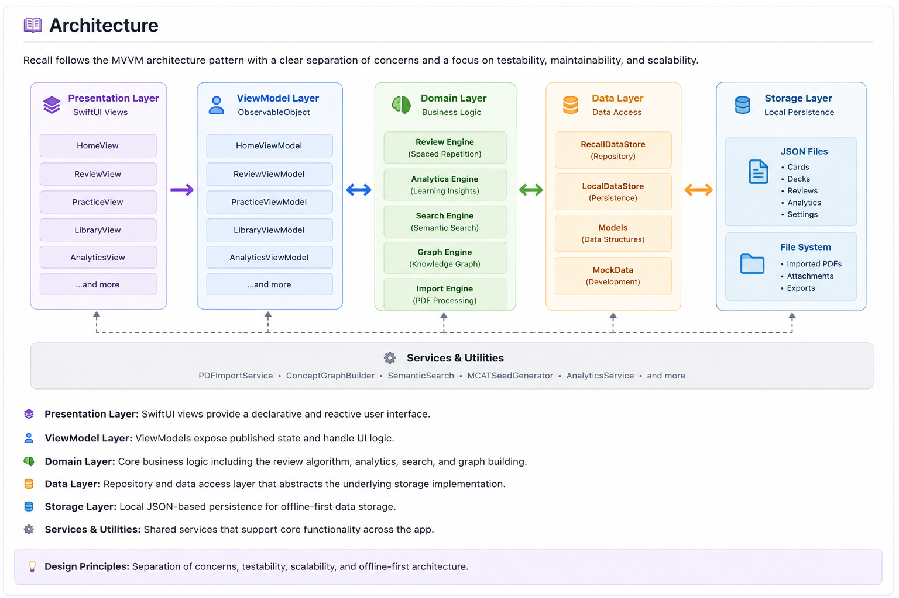

# Recall

> An adaptive study platform built with SwiftUI that combines spaced repetition, personalized learning analytics, and intelligent review recommendations.

---

## Overview

Recall is a SwiftUI application designed to help students retain knowledge more effectively through adaptive review.

Instead of repeatedly presenting the same flashcards, Recall analyzes user performance and recommends targeted study sessions based on previous learning behavior.

The project explores modern software architecture, state management, and scalable data models while creating a practical learning application.

---

## Features

- 📚 Flashcard library management
- 🧠 Adaptive spaced repetition
- 📈 Personalized learning analytics
- 🔍 Semantic search
- 🌳 Knowledge graph visualization
- 📄 PDF import pipeline
- 📝 Practice and review modes

---

## Screenshots

### Analytics Dashboard


### Active Recall Session


### MCAT Review Home


---

## Software Architecture



Recall follows a modular MVVM architecture that separates the user interface, business logic, data access, and local persistence layers. This structure makes the app easier to maintain, scale, and extend with features like semantic search, knowledge graphs, and PDF import.

---

## Technology Stack

| Category | Technologies |
|----------|--------------|
| Language | Swift |
| Framework | SwiftUI |
| IDE | Xcode |
| Architecture | MVVM |
| Storage | Local Data Store |
| Data | JSON |

---

## Project Structure

```
Recall
├── Views
├── Models
├── Data Store
├── Analytics
├── Search
├── Graph
└── Import Services
```

---

## Future Improvements

- Cloud synchronization
- AI-generated flashcards
- Collaborative study decks
- Cross-device synchronization
- Intelligent concept recommendations

---

## License

MIT License
